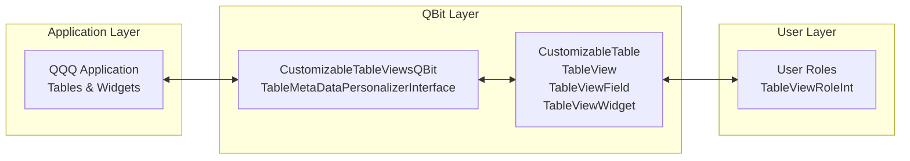

# QBit: Customizable Table Views
[](https://circleci.com/gh/Kingsrook/qbit-customizable-table-views)
[](https://central.sonatype.com/namespace/com.kingsrook.qbits)
[](https://adoptium.net/)
[](LICENSE.txt)

**QBit Customizable Table Views** provides table personalization capabilities for QQQ applications, allowing users to customize which fields and widgets they see based on their roles and permissions.

## 🚀 What Makes This QBit Different?

**Role-Based Table Customization** - This QBit enables fine-grained control over table presentation without modifying application code. Users see different fields and widgets based on their assigned roles, providing a personalized experience while maintaining security and data integrity.

## 🔓 Open Source & Full Control

**This QBit is 100% open source** - you have complete ownership and control:

- **💻 Your Code**: Full access to the QBit's source code
- **🗄️ Your Data**: All customization data stays in your systems
- **🏗️ Your System**: Deploy anywhere - on-premises, cloud, or hybrid
- **🔒 No Vendor Lock-in**: No SaaS subscriptions, no proprietary dependencies
- **⚡ Full Customization**: Modify, extend, and adapt the QBit to your exact needs
- **🌍 Community Driven**: Built by engineers, for engineers

### ✨ Core Capabilities

- **🎯 Table Personalization**: Customize field visibility and widget access per user role
- **🔐 Role-Based Access**: Control table views through user role assignments
- **⚙️ Flexible Configuration**: Set up customizations before activation
- **🔄 Dynamic Merging**: Combine multiple table views using least-restrictive rules
- **📊 Access Level Management**: Control field access (Hidden, Read-only, Required, Optional)

## 🏗️ Architecture

This QBit implements QQQ's `TableMetaDataPersonalizerInterface` to provide table customization capabilities:



### Technology Stack

- **Java**: Java 17+ with UTF-8 encoding
- **QQQ Framework**: Built on QQQ's metadata-driven architecture
- **Maven**: Standard Maven build system
- **Role Management**: Integrates with QQQ's role and permission system

## 🚀 Quick Start

### Prerequisites
- **Java 17+** (required for QQQ features)
- **Maven 3.8+** (for build system)
- **QQQ Framework** (parent framework)

### Build Locally
```bash
# Clone the repository
git clone git@github.com:Kingsrook/qbit-customizable-table-views.git
cd qbit-customizable-table-views

# Build the QBit
mvn clean install
```

### Use in Your Project
```xml
<dependency>
    <groupId>com.kingsrook.qbits</groupId>
    <artifactId>qbit-customizable-table-views</artifactId>
    <version>...</version>
</dependency>
```

## 📚 Documentation

**📖 [Complete Documentation Wiki](https://github.com/Kingsrook/qqq/wiki)** - Start here for comprehensive guides

- **[🏠 Home](https://github.com/Kingsrook/qqq/wiki/Home)** - Project overview and quick start
- **[🏗️ Architecture](https://github.com/Kingsrook/qqq/wiki/High-Level-Architecture)** - System design and principles
- **[🔧 Development](https://github.com/Kingsrook/qqq/wiki/Developer-Onboarding)** - Setup and contribution guide
- **[📦 QBits](https://github.com/Kingsrook/qqq/wiki/QBit-Development)** - QBit development guide
- **[🚀 Building](https://github.com/Kingsrook/qqq/wiki/Building-Locally)** - Local development workflow

## 🤝 Contributing

This QBit is **open source** and welcomes contributions! 

- **🐛 [Report Issues](https://github.com/Kingsrook/qqq/issues)** - Bug reports and feature requests
- **📝 [Contribution Guide](https://github.com/Kingsrook/qqq/wiki/Contribution-Guidelines)** - How to contribute code and documentation
- **🔍 [Code Standards](https://github.com/Kingsrook/qqq/wiki/Code-Review-Standards)** - QQQ's coding standards and review process

**First time contributing?** Start with our [Developer Onboarding Guide](https://github.com/Kingsrook/qqq/wiki/Developer-Onboarding) to get your environment set up.

## 🏢 About Kingsrook

This QBit is built by **[Kingsrook](https://qrun.io)** - making engineers more productive through intelligent automation and developer tools.

- **Website**: [https://qrun.io](https://qrun.io)
- **Contact**: [contact@kingsrook.com](mailto:contact@kingsrook.com)
- **GitHub**: [https://github.com/Kingsrook](https://github.com/Kingsrook)

## 📄 License

This project is licensed under the **GNU Affero General Public License v3.0** - see the [LICENSE.txt](LICENSE.txt) file for details.

---

## 📖 Detailed Usage Guide

### Overview
*Note:  This is one of the original QBit implementations - so, some of the mechanics of how
it is loaded and used by an application are not exactly fully defined at the time of its
creation... Please excuse any dust or not-quite-round wheels you find here!*

This QBit provides an implementation of QQQ's `TableMetaDataPersonalizerInterface` along with
management tables for the same.    

The idea behind this model for table personalization (aka customization) is as follows:
* By default, no tables in the app are customized.
  * This means that all users can see all fields and widgets, as the table is defined in the application code.
* For a table to be customized, a record for it must exist in the **Customizable Table** table.  
  * Custom views of a table will not actually apply to users in the application until the **Customizable Table** record
    for the table has its **Is Active** field set to true.  The idea being, that you can set up custom views for a table
    before they are activated and applied to users.  
* Setting up a customized table consists of building one or more **Table View** records.  A Table View is a 
  definition of how the table should be presented to a user (e.g., which fields and widgets they will have access to).
  each table view record consists of:
  * The table that the view applies to.
  * A list of **Fields** from the table along with an **Access Level** for the field. See below for additional
    details on access levels.
  * A list of **Widgets** from that table.
* Table Views are assigned to users via user roles, by building records in the **Table View Role Int** (intersection)
  table.  
* In addition, a **Default Table View** can optionally be set in the **Customizable Table** record for a table.  

#### Applying Customization
* When a table is customized (e.g., its Customizable Table record's Is Active field is true):
  * All non-required fields are removed from the table for all users.  In other words, the only fields left in the table
    are any fields marked in the application code as required (plus the table's primary key / id).  Also, all widgets 
    are removed from the table.  
  * From this base set of required fields and zero widgets, all Table Views that are assigned to the user (via their 
    roles) are merged together to define the set of fields and widgets that the user can see. 
  * If a user does not have access to any Table Views via their roles, but the table does have a Default Table View, 
    then that is the only Table View that is available to the user.

#### Field Access Level Rules
* Fields in tables can generally have 4 levels of pre-defined access, coded into the application:
  * **Hidden** - the field is not visible to any user.  It only exists for the system to use, but not for users to see.
  * **Read-only** - the field is visible, but users cannot edit its value.  ex. *Create Date*, *Id*
  * **Required** - the field is visible and editable, and all records MUST have a value.  ex. *Name* (on several tables 
    that are uniquely identified by Name)
  * **Optional** - the field is visible and editable, and records may or may not have a value.  ex. *Description* or 
    *Ship To Address 2*.
* In a custom Table View, at a basic level, you are defining what fields should be available to a user. However, 
  there is a limited set of adjustments you can make to the access level for fields.  Specifically, Optional fields 
  can be changed to be Read-Only or Required.  
* Furthermore, when multiple Table Views are being merged together (e.g., because a user has multiple roles each of 
  which have a Table View associated with them), the logic of what Access Rules applies is generally referred to as 
  "least-restrictive rule wins".  
  * For example, a field being Optional is a lesser restriction than a field being Required, so if one Table View 
    has a field marked as Optional, and another has it as Required, then the result is that the field will be Optional.
  * The full set of combinations of access levels and their resulting output is:
```
Hidden    + Read-only = Read-only
Hidden    + Required  = Required
Hidden    + Optional  = Optional
Read-only + Required  = Required
Read-only + Optional  = Optional
Required  + Optional  = Optional
```

### Usage

#### Pom dependency
```xml
<dependency>
    <groupId>com.kingsrook.qbits</groupId>
    <artifactId>qbit-customizable-table-views</artifactId>
    <version>...</version>
</dependency>
```

#### Setup
```java
// configure the qbit:
CustomizableTableViewsQBitConfig config = new CustomizableTableViewsQBitConfig()
  // if any table customizations are required:
  .withTableMetaDataCustomizer(tableMetaDataCustomizer);

// create a qbit producer and produce all of the qbit's meta data
CustomizableTableViewsQBitProducer producer = new CustomizableTableViewsQBitProducer().withQBitConfig(config);
MetaDataProducerMultiOutput allQBitMetaData = producer.produce(qInstance);

// register the table meta data personlizer
CustomizableTableViewsQBitProducer.activateTableMetaDataPersonalizerInterface(qInstance);

// either return allQBitMetaData from a MetaDataProducerInterface, or 
// call: allQBitMetaData.addSelfToInstance(qInstance);
```

### Provides
#### Tables
* **CustomizableTable** - marks a table as being eligible for customization (building TableView records), and controls if 
  customizations are actually active for users in the application or not.
* **TableView** - a set of fields and widgets to apply to a CustomizableTable.
* **TableViewField** - a single field with access level that is part of a TableView
* **TableViewWidget** - a single widget that is part of a TableView
* **TableViewRoleInt** - intersection record between TableView and Role.

#### Classes
The key business logic of this QBit is provided by `CustomizableTableViewsTablePersonalizer` which implements 
`TableMetaDataPersonalizerInterface`, and applies the table personalization logic to tables in the application, 
based on data in the tables. 

This class needs to be registered in a QInstance as a supplemental code reference, which can be done by:
`CustomizableTableViewsQBitProducer.activateTableMetaDataPersonalizerInterface(qInstance);`

### Dependencies
#### Roles
* `CustomizableTableViewsTablePersonalizer` depends on a user's session having an entry in its values map called 
  `"roleIds"`.  This value is expected to be a comma-delimited list of role ids assigned to the user.  
  * You may need to set this value in the session yourself, in an implementation of 
    `QAuthenticationModuleCustomizerInterface` in the `finalCustomizeSession` method, such as:
```java
Set<Integer> roleIds = PermissionManager.getInstance().getRoleIdsForUser(userId);
qSession.setValue("roleIds", StringUtils.join(",", roleIds));
```
* The `TableViewRoleInt` table's `roleId` field is set with `possibleValueSourceName = "role"`.  This table and PVS 
  can be provided by `qbit-user-role-permission`, or, any application-defined role table.

## 🆘 Support & Community

### ⚠️ Important: Use Main QQQ Repository

**All support, issues, discussions, and community interactions should go through the main QQQ repository:**

- **Main Repository**: https://github.com/Kingsrook/qqq
- **Issues**: https://github.com/Kingsrook/qqq/issues
- **Discussions**: https://github.com/Kingsrook/qqq/discussions
- **Wiki**: https://github.com/Kingsrook/qqq.wiki

### Why This Repository Exists

This repository is maintained separately from the main QQQ repository to:
- **Enable independent QBit development** and versioning
- **Allow QBit-specific CI/CD** and deployment pipelines
- **Provide clear separation** between QBit functionality and core framework concerns
- **Support different release cycles** for QBits vs. core framework

### Getting Help

- **Documentation**: Check the [QQQ Wiki](https://github.com/Kingsrook/qqq.wiki)
- **Issues**: Report bugs and feature requests on [Main QQQ Issues](https://github.com/Kingsrook/qqq/issues)
- **Discussions**: Join community discussions on [Main QQQ Discussions](https://github.com/Kingsrook/qqq/discussions)
- **Questions**: Ask questions in the main QQQ repository

### Contact Information

- **Company**: Kingsrook, LLC
- **Email**: contact@kingsrook.com
- **Website**: https://kingsrook.com
- **Main GitHub**: https://github.com/Kingsrook/qqq

## 🙏 Acknowledgments

- **QQQ Framework Team**: For the underlying low-code platform
- **QBit Development Team**: For the customizable table views implementation
- **Open Source Community**: For the tools and libraries that make this possible

---

**Built with ❤️ by the Kingsrook Team**

**This is a QBit component of the QQQ framework. For complete information, support, and community, visit: https://github.com/Kingsrook/qqq** 
